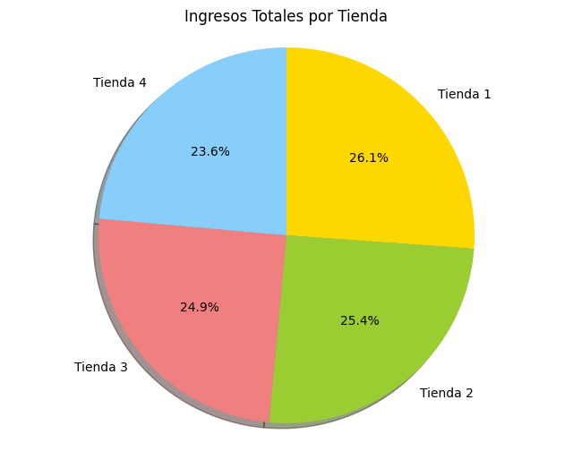
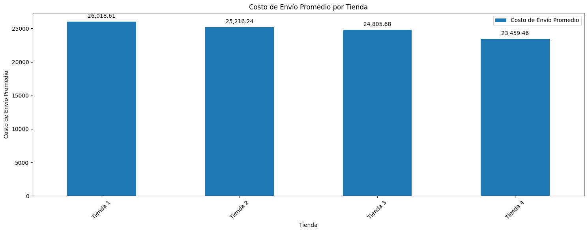
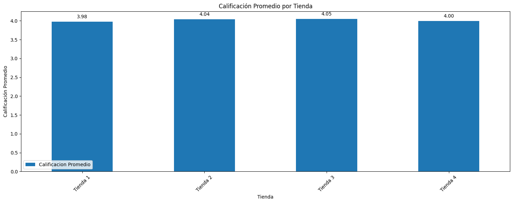

# 📊 Challenge Alura Store Latam

Bienvenido al repositorio del *Challenge Alura Store Latam*, un proyecto de análisis de datos realizado como parte de un reto técnico.

---

## 🎯 **Objetivo del proyecto**

Este proyecto tiene como objetivo analizar el desempeño de **cuatro tiendas de Alura Store**con el fin de **identificar cuál de ellas presenta los resultados menos favorables y es candidata a ser cerrada.**

Se analiza:

- Ingresos por ventas
- Ventas por categoría
- Experiencia del cliente (calificaciones)
- Costo de envío
- Distribución geográfica de las ventas
  
A partir de estos indicadores, se generan visualizaciones y conclusiones que respaldan la toma de decisiones estratégica.
---

## 📋 **Descripción del análisis**

Este proyecto incluye:

### 🧮 Análisis cuantitativo
- Resumen de ventas por tienda
- Comparación de costos de envío
- Eficiencia logística
- Calificación promedio de experiencia de cliente

### 📊 Análisis comparativo
- Interpretación de KPI’s por tienda
- Ranking objetivo para toma de decisiones
- Conclusión y recomendación respaldada por datos

---

## 🛠️ **Herramientas y métodos**

El análisis está realizado utilizando:

- **Python**
  - Pandas
  - Jupyter Notebook
- Visualizaciones básicas
- Indicadores de desempeño empresarial

---

## 📁 **Estructura del repositorio**

El repositorio contiene los siguientes archivos:

├── 📓 AluraStore.ipynb        # Notebook principal con el análisis completo

├── 📄 tienda_1.csv            # Datos de ventas de la Tienda 1

├── 📄 tienda_2.csv            # Datos de ventas de la Tienda 2

├── 📄 tienda_3.csv            # Datos de ventas de la Tienda 3

├── 📄 tienda_4.csv            # Datos de ventas de la Tienda 4

├── 📁 images                  # Gráficos generados en el análisis

└── README.md                  # Documentación del proyecto

- **CSV**: Datos por tienda
- **Notebook (.ipynb)**: Análisis completo y conclusiones paso a paso

## 📓 Contenido del notebook

El notebook AluraStore.ipynb está organizado en las siguientes secciones:

- Carga y exploración de datos
- Análisis de métricas por tienda
- Visualización de resultados
- Comparación entre tiendas
- Conclusiones y recomendación final

##**Análisis y gráficos**

**Ingresos totales por tienda**

La Tienda 4 presenta los ingresos más bajos, a pesar de tener una cantidad de productos vendidos muy similar a las demás tiendas.

**Costo promedio de envío por tienda**

La Tienda 4 tiene el costo de envío promedio más bajo, lo que podría indicar menor cobertura logística o estrategias de envío diferentes, sin que esto se traduzca en mayores ingresos o mejor percepción del cliente.

**Calificación promedio**

Las calificaciones promedio son muy similares entre tiendas, por lo que la experiencia del cliente no es el principal diferenciador en la decisión de cierre.

---

## 🧠 **Conclusión principal**

Después de comparar las cuatro tiendas con métricas clave, el análisis determinó que:

> **La Tienda 4 tiene el desempeño global más bajo**, considerando ventas totales, ingreso por pedido y ranking objetivo, por lo que fue identificada como la principal candidata a cierre,
> sujeta a validación de costos fijos y cobertura geográfica.

Esto se basa en un enfoque cuantitativo orientado a la **optimización del portafolio de ventas**.

---

##**▶️ Instrucciones para ejecutar el notebook**
🔧 Requisitos

-Python 3.x
-Jupyter Notebook
-Librerías:
  -pandas
  -matplotlib
  -seaborn

**📝 Pasos para ejecutar**

1. Clona este repositorio:
git clone https://github.com/patinohoyosgisell/Challenge-Alura-Store.git

2. Accede a la carpeta del proyecto:
cd Challenge-Alura-Store

3. Abre el notebook:
jupyter notebook AluraStore.ipynb

Ejecuta las celdas en orden para reproducir el análisis.

*💡 También puedes subir el notebook a Google Colab y ejecutar el análisis sin configuración local.*

## 🖋️ **Sobre la autora**

Este proyecto fue realizado por:

**Gisell Patiño Hoyos**  
📍 Analista de datos  

---

## 🏁 ¡Gracias por visitar este repositorio!

